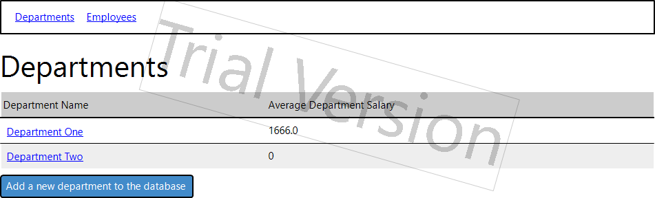

# Departments App
## Vision
"Departments App" is a web application that allows users to view and edit information about departments and related employees.

The application should be able to:
* Store departments and employees in a database;
* Display list of departments;
* Update the list of departments (add, edit, remove);
* Display list of employees;
* Update the list of employees (add, edit, remove);
* Filter employees by date of birth.

## 1. Departments
### 1.1 Display list of Departments
The mode allows to view the list of all departments and add new ones.
#### _Main scenario_:
* User selects menu item "Departments";
* Application displays the list of Departments links.

Pic. 1.1 Departments list view.

The list displays the following columns:
* Department Name - the name of a department;
* Average Department Salary - average salary of department employees.

### 1.2 Add department
#### _Main scenario:_
* User clicks the "Add a new department to the database" button in the department list view mode;
* Application displays form to enter department data;
* User enters department data and presses "Submit" button;
* If entered data is incomplete, incomplete data messages are displayed;
* If entered data is valid, then the record is added to the database;
* if a new department record addition is a success, the list of departments with the added record is displayed.

#### _Cancel operation scenario:_
* User clicks the "Add a new department to the database" button in the department list view mode;
* Application displays form to enter department data;
* User enters department data without pressing "Submit" button afterwards;
* If the user selects the menu item "Departments" or "Employees", the data is not saved to the database. The corresponding view list is displayed afterwards.

Pic. 1.2 Add department form.

When adding a department, the following details are required:
* New department name - a name of an added department.

### 1.3 Display department information
#### _Main scenario:_
* User clicks on a department link in the "Department Name" column in the department list view mode.
* Application displays a page of the clicked department.

Pic. 1.3 Department information view.

The following information is displayed:
* Department name - department name in the title format.
* Average department salary - average salary of department employees;
* Number of employees - total number of department employees.

### 1.4 Edit department information
#### _Main scenario:_
* User clicks the "Edit department name" button in the department view mode;
* Application displays form to enter department data;
* User enters department data and presses "Submit" button;
* If entered data is incomplete, incomplete data messages are displayed;
* If entered data is valid, then the record is changed in the database;
* if the department record is successfully changed, the department information with the edited record is displayed.

#### _Cancel operation scenario:_
* User clicks the "Edit department name" button in the department view mode;
* Application displays form to enter department data;
* User enters department data without pressing "Submit" button afterwards;
* If the user selects the menu item "Departments" or "Employees", the edited is not saved to the database. The corresponding view list is displayed afterwards.

Pic. 1.4 Edit department form.

When editing a department, the following details are required:
* New department name - a name of an edited department.

### 1.5 Remove department
#### _Main scenario:_
* The user, while in the department view, presses the "Delete this department" button;
* Department record disappears from the database, along with all the employee records related to this department;
* After the department record deletion is successful, the list of departments without the deleted record is displayed.

## 2. Employees
### 2.1 Display list of Employees
This mode is intended for viewing, searching and adding employees.
#### _Main scenario:_
* User selects the menu item "Employees";
* Application displays the list of employees.

Pic. 2.1 Employees list view.

The list displays the following columns:
* Employee Name - employee's name;
* Employee Salary - salary of an employee.

### 2.2 Search employee by birthday
#### _Main scenario:_
* User clicks the "Search an employee by birthday" button in the employee list view mode;
* Application displays two forms to enter query data;
* User enters query data in either of the forms and presses one of the "Submit" buttons;
* If the search is successful, a clickable link or a list of clickable links of found employee names appears under the "Results" title;
* If the search is unsuccessful, or if there was no search, a message "Sorry, no results yet" is displayed;
* If entered data is incomplete, incomplete data messages are displayed;

#### _Cancel operation scenario:_
* User clicks the "Search an employee by birthday" button in the employee list view mode;
* Application displays two forms to enter query data;
* User enters query data in either of the forms without pressing one of the "Submit" buttons afterwards;
* If the user selects the menu item "Departments" or "Employees", the query data is not used. The corresponding view list is displayed afterwards.

Pic. 2.2 Employee search forms.

When searching for an employee, the following details are required:
* If the desired search is by an exact date, the first form is used. The entered data is a date;
* If the desired search is between dates, the second form is used. The entered data is a date;
* The second form from the top takes two dates as an input - "Earliest date of birth" and "Latest date of birth".

### 2.3 Add employee
#### _Main scenario:_
* User clicks the "Add a new employee to the database" button in the employees list view mode;
* Application displays form to enter employee data;
* User enters employee data and presses "Submit" button;
* If any data is incorrect, incorrect data messages are displayed;
* If entered data is incomplete, incomplete data messages are displayed;
* If entered data is valid, the record enters the database;
* If a new employee record addition is successful, the list of employees with the added record is displayed.

#### _Cancel operation scenario:_
* User clicks the "Add a new employee to the database" button in the employees list view mode;
* Application displays form to enter employee data;
* User enters employee data without pressing the "Submit" button;
* If the user selects the menu item "Departments" or "Employees", the entered data is not used. The corresponding view list is displayed afterwards.

Pic. 2.3 Add employee form.

When adding an employee, the following details are required:
* Employee name - employee's name;
* Employee salary - employee's salary;
* Employee date of birth - employee's birthday, in the form of a date;
* Department of an employee - employee's department, chosen from a list of all departments in the database.

Constrains for data validation:
* Employee salary - entered data must be a number.

### 2.4 Display employee information
#### _Main scenario:_
* User clicks on an employee link in the "Employee Name" column in the employee list view mode;
* Application displays a page of the clicked employee.

Pic. 2.4 Employee information view.

The following information is displayed:
* Employee name in the title format;
* Employee salary in numbers;
* Employee department as a clickable link, which the user can follow to view information about this particular department.

### 2.5 Edit employee information
#### _Main scenario:_
* User clicks the "Edit employee information" button in the employee information view mode;
* Application displays form to edit employee data;
* User edits employee data and presses "Submit" button;
* If any data is incorrect, incorrect data messages are displayed;
* If entered data is incomplete, incomplete data messages are displayed;
* If entered data is valid, the record changes in the database;
* If the employee record is successfully changed, the page of an employee with the edited record is displayed.

#### _Cancel operation scenario:_
* User clicks the "Edit employee information" button in the employee information view mode;
* Application displays form to edit employee data;
* User edits employee data without pressing the "Submit" button;
* If the user selects the menu item "Departments" or "Employees", the edited data is not used to change an employee record. The corresponding view list is displayed afterwards.

Pic. 2.5 Edit employee form.

When editing an employee, the following details are required:
* Employee name - employee's name;
* Employee salary - employee's salary;
* Employee date of birth - employee's birthday, in the form of a date;
* Department of an employee - employee's department, chosen from a list of all departments in the database.

Constrains for data validation:
* Employee salary - entered data must be a number.

### 2.6 Removing the employee
#### _Main scenario:_
* The user, while in the employee view, presses the "Delete this employee" button;
* Employee record is deleted from the database;
* After the employee record deletion is successful, the employee list without deleted records is displayed.
